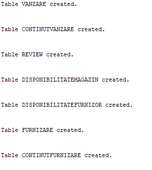
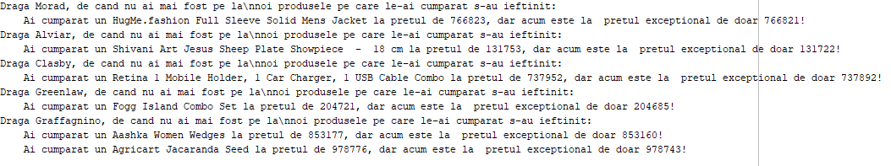
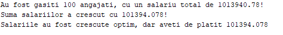
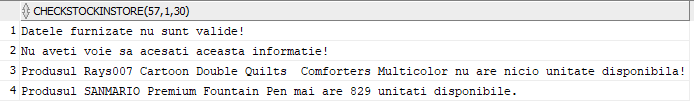
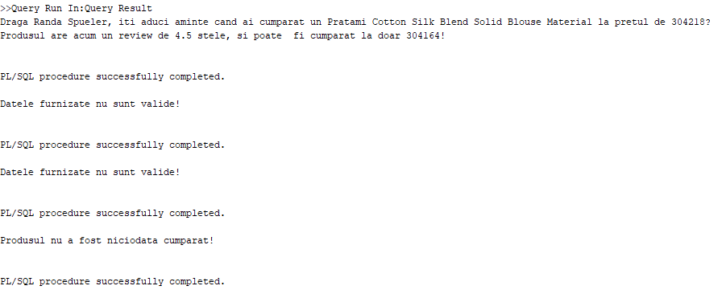
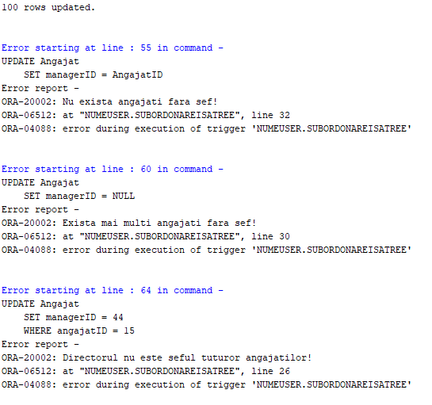
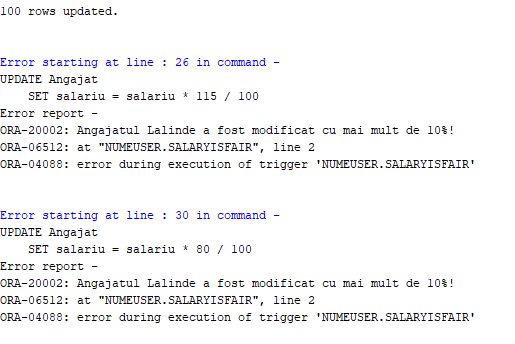
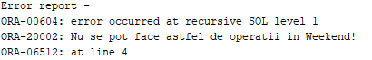
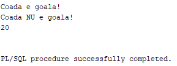

# SGDB_Project

## Introducere

In acest document voi prezenta totalitatea codului folosit in cadrul proiectului meu pentru cursul de sisteme de gestiune a bazelor de date.
Rezolvarile se afla toate in acest repo.

## Diagrama Entitate-Relatie Si Diagrama Conceptuala

Cele doua diagrame se afla in fisierele [diagram.pdf](diagram.pdf) si [EntitateRelatie.pdf](EntitateRelatie.pdf).

Versiunea raw a diagramelor (facuta in Microsoft Visio 2019) este disponibila in fisierele [diagram.vsdx](diagram.vsdx) si [EntitateRelatie.vsdx](EntitateRelatie.vsdx), dar deschiderea acestora necesita un program specializat.

## Cerinta 4 -- Implementarea In Oracle A Diagramei Conceptuale

Codul se afla [aici](CreateDataBase.sql).

```SQL
CREATE TABLE locatie (
    locatieID NUMBER PRIMARY KEY,
    adresa VARCHAR2(100),
    oras VARCHAR2(50),
    tara VARCHAR2(30));

CREATE TABLE furnizor (
    furnizorID NUMBER PRIMARY KEY,
    nume VARCHAR2(100),
    dataIncepereParteneriat DATE,
    telefon VARCHAR2(10),
    locatieID NUMBER,
    FOREIGN KEY (locatieID) REFERENCES locatie(locatieID) ON DELETE SET NULL);
    
CREATE TABLE angajat (
    angajatID NUMBER PRIMARY KEY,
    nume VARCHAR2(50),
    prenume VARCHAR2(50),
    magazinID NUMBER,
    managerID NUMBER,
    salariu NUMBER,
    dataAngajare Date,
    FOREIGN KEY (managerID) REFERENCES angajat(angajatID) ON DELETE SET NULL);
    
CREATE TABLE magazin (
    magazinID NUMBER PRIMARY KEY,
    locatieID NUMBER,
    managerID Number,
    dataDeschidere Date,
    FOREIGN KEY (managerID) REFERENCES angajat(angajatID) ON DELETE SET NULL,
    FOREIGN KEY (locatieID) REFERENCES locatie(locatieID) ON DELETE SET NULL);

ALTER TABLE angajat
    ADD CONSTRAINT angajatfkmagazin FOREIGN KEY (magazinID) REFERENCES magazin(magazinID);
    
CREATE TABLE produs (
    produsID NUMBER PRIMARY KEY,
    nume VARCHAR2(200),
    descriere VARCHAR2(200));
    
CREATE TABLE cumparator (
    cumparatorID NUMBER PRIMARY KEY,
    nume VARCHAR2(100),
    prenume VARCHAR2(100),
    varsta NUMBER,
    puncteFidelitate NUMBER,
    locatieID NUMBER,
    dataCreareCont DATE,
    telefon NUMBER(10),
    FOREIGN KEY (locatieID) REFERENCES locatie(locatieID) ON DELETE SET NULL);
    
CREATE TABLE vanzare (
    vanzareID NUMBER PRIMARY KEY,
    magazinID NUMBER,
    cumparatorID NUMBER,
    dataVanzare DATE,
    pretTotal NUMBER NOT NULL,
    FOREIGN KEY (magazinID) REFERENCES magazin(magazinID) ON DELETE SET NULL,
    FOREIGN KEY (cumparatorID) REFERENCES cumparator(cumparatorID) ON DELETE CASCADE);

CREATE TABLE continutVanzare (
    vanzareID NUMBER,
    produsID NUMBER,
    pretUnitar NUMBER NOT NULL,
    cantitate NUMBER NOT NULL,
    PRIMARY KEY (vanzareID, produsID),
    FOREIGN KEY (vanzareID) REFERENCES vanzare(vanzareID) ON DELETE CASCADE,
    FOREIGN KEY (produsID) REFERENCES produs(produsID) ON DELETE SET NULL);

CREATE TABLE review (
    vanzareID NUMBER,
    produsID NUMBER,
    rating NUMBER NOT NULL,
    comentariu VARCHAR2(1000),
    PRIMARY KEY (vanzareID, produsID),
    FOREIGN KEY (vanzareID) REFERENCES vanzare(vanzareID) ON DELETE CASCADE,
    FOREIGN KEY (produsID) REFERENCES produs(produsID) ON DELETE SET NULL,
    CHECK (rating >= 1 AND rating <= 5));
    
CREATE TABLE disponibilitateMagazin (
    produsID NUMBER,
    magazinID NUMBER,
    cantitateDisponibila NUMBER NOT NULL,
    pretUnitar NUMBER NOT NULL,
    PRIMARY KEY (produsID, magazinID),
    FOREIGN KEY (produsID) REFERENCES produs(produsID) ON DELETE CASCADE,
    FOREIGN KEY (magazinID) REFERENCES magazin(magazinID) ON DELETE CASCADE,
    CHECK (cantitateDisponibila >= 0),
    CHECK (pretUnitar > 0));
    
CREATE TABLE disponibilitateFurnizor (
    furnizorID NUMBER,
    produsID NUMBER,
    stocDisponibil NUMBER NOT NULL,
    pretUnitar NUMBER,
    PRIMARY KEY (furnizorID, produsID),
    FOREIGN KEY (furnizorID) REFERENCES furnizor(furnizorID) ON DELETE CASCADE,
    FOREIGN KEY (produsID) REFERENCES produs(produsID) ON DELETE CASCADE);
    
CREATE TABLE furnizare (
    furnizareID NUMBER PRIMARY KEY,
    magazinID NUMBER,
    pretTotal NUMBER NOT NULL,
    furnizorID NUMBER,
    FOREIGN KEY (furnizorID) REFERENCES furnizor(furnizorID) ON DELETE SET NULL,
    FOREIGN KEY (magazinID) REFERENCES magazin(magazinID) ON DELETE CASCADE,
    CHECK (pretTotal > 0));
    
CREATE TABLE continutFurnizare (
    furnizareID NUMBER,
    produsID NUMBER,
    cantitate NUMBER NOT NULL,
    pretUnitar NUMBER NOT NULL,
    PRIMARY KEY (furnizareID, produsID),
    FOREIGN KEY (furnizareID) REFERENCES furnizare(furnizareID) ON DELETE CASCADE,
    FOREIGN KEY (produsID) REFERENCES produs(produsID) ON DELETE SET NULL,
    CHECK (cantitate > 0 AND pretUnitar > 0));
```

Executia codului de mai sus creaza tabelele:



## Cerinta 5 -- Adaugarea Informatiilor Coerente In Baza De Date

Pentru a popula baza de date am creat un script de `Python` cu ajutorul caruia am creat fisierul [PopulateDataBase.sql](PopulateDataBase.sql), cu ajutorul caruia introduc 13.000 de inregistrari in baza de date.

Din motive evidente am decis sa nu il includ in acest document, fiind disponibil [aici](PopulateDataBase.sql).

## Cerinta 6 -- Subprogram Care Sa Utilizeze Un Tip Colectie

Codul se afla [aici](Cerinta_Nr_6.sql).

```SQL
-- Autor: Moroianu Theodor
-- Date: 27.11.2020
-- Cerinta: Cerinta nr 6

-- Compania vrea sa organizeze o campanie de promotie de craciun.
-- Pentru aceasta campanie, compania doreste sa ii trimita fiecarui
-- cumparator un mesaj de tipul "De cand nu ai mai fost pe la noi
-- produsele pe care le-ai cumparat ultima data s-au ieftinit:
--      Ai cumparat produsul X la Y dar acum il poti cumpara la Z ...".
-- Evident, campania aceasta este facuta doar pentru a atrage clientii,
-- deci presupunem ca pretul unui produs este costul cel mai ieftin al
-- produsului in oricare dintre magazinele in care este in stoc.

-- Subprogramul definit jos de tot, prin apeluri la functiile definite
-- tot aici, foloseste un tip de colectie studiat.

SET SERVEROUTPUT ON;

CREATE OR REPLACE PROCEDURE PrintPromotion
IS
    type Tablou IS TABLE OF NUMBER INDEX BY BINARY_INTEGER;
    
    pretMinimProduse        Tablou;
    achizitiiClient         Tablou;
    contor                  NUMBER;
    
    -- Valuarea minima din doua valori.
    FUNCTION MyMin (
        a   NUMBER,
        b   NUMBER)
    RETURN NUMBER
    IS BEGIN
        IF a < b THEN
            RETURN b;
        END IF;
        return b;
    END MyMin;
    
    -- Returneaza numele unui produs.
    FUNCTION ProductName (
        produs_id_c NUMBER)
    RETURN VARCHAR2
    IS
        nume_p    VARCHAR2(1000);
    BEGIN
        SELECT nume
            INTO nume_p
            FROM produs
            WHERE produs_id_c = produsId;
        RETURN nume_p;
    EXCEPTION
        WHEN NO_DATA_FOUND THEN
            DBMS_OUTPUT.PUT_LINE('A aparut o eroare!');
            RETURN 'Name not found';
    END ProductName;
    
    -- Functie care returneaza pentru un client
    -- care sunt preturile platite pentru produsele
    -- din ultima achizitie.
    FUNCTION UltimaAchizitieClient (
        c_id    NUMBER)
    RETURN Tablou 
    IS
        v           Tablou;
        vanzare     NUMBER;
    BEGIN
        SELECT *
            INTO vanzare
            FROM (SELECT vanzareId
                  FROM vanzare
                  WHERE cumparatorId = c_id
                  ORDER BY DataVanzare DESC)
            WHERE ROWNUM = 1;
            
        FOR cont IN (SELECT *
                        FROM ContinutVanzare cv
                        WHERE vanzareId = vanzare) LOOP
            v(cont.ProdusId) := cont.PretUnitar;
        END LOOP;
        return v;
    EXCEPTION
        WHEN NO_DATA_FOUND THEN
            RETURN v;
    END UltimaAchizitieClient;
    
    -- Functie care returneaza cel mai ieftin pret
    -- al unui produs existent.
    FUNCTION PretMinimInStoc
    RETURN Tablou 
    IS
        v           Tablou;
    BEGIN
        FOR disponibil IN (SELECT *
                                FROM DisponibilitateMagazin) LOOP
            IF v.EXISTS(disponibil.produsid) THEN
                v(disponibil.produsid) := MyMin(v(disponibil.produsid), disponibil.pretunitar);
            ELSE
                v(disponibil.produsid) := disponibil.pretunitar;
            END IF;
        END LOOP;
        return v;
    END PretMinimInStoc;
    
BEGIN
    pretMinimProduse := PretMinimInStoc;
    
    FOR cumparator IN (SELECT * FROM cumparator) LOOP
        achizitiiClient := UltimaAchizitieClient(cumparator.cumparatorId);
        contor := 0;
        
        IF achizitiiClient.COUNT = 0 THEN
            CONTINUE;
        END IF;
        
        FOR i IN achizitiiClient.First .. AchizitiiClient.Last LOOP
            IF pretMinimProduse.EXISTS(i) AND achizitiiClient.EXISTS(i) AND
                    pretMinimProduse(i) < achizitiiClient(i) THEN
                contor := contor + 1;
            END IF;
        END LOOP;
        
        -- Are reduceri.
        IF contor <> 0 THEN
            DBMS_OUTPUT.PUT_LINE('Draga ' || cumparator.prenume || ', de cand nu ai mai fost pe la\n' ||
                    'noi produsele pe care le-ai cumparat s-au ieftinit:');
            FOR i IN achizitiiClient.First .. AchizitiiClient.Last LOOP
                IF pretMinimProduse.EXISTS(i) AND achizitiiClient.EXISTS(i) AND
                        pretMinimProduse(i) < achizitiiClient(i) THEN
                    DBMS_OUTPUT.PUT_LINE('    Ai cumparat un ' || ProductName(i) ||
                            ' la pretul de ' || achizitiiClient(i) || ', dar acum este la ' ||
                            ' pretul exceptional de doar ' || pretMinimProduse(i) || '!');
                END IF;
            END LOOP;
        END IF;
    END LOOP;
END;
/

EXECUTE PrintPromotion;
```

Executia codului de mai sus da urmatorul rezultat:



## Cerinta 7 -- Subprogram Care Sa Utilizeze Un Cursor

Codul se afla [aici](Cerinta_Nr_7.sql).

```SQL
-- Autor: Moroianu Theodor
-- Date: 25.11.2020
-- Cerinta: Cerinta nr 7

-- Compania a decis sa dea bonus de craciun angajatilor.
-- Evident, nu are asa multi bani de cheltuit, asa ca doreste sa 
-- cheltuie cat mai putini.
-- Astfel compania a decis sa premieze un angajat, subordonatii sai
-- directi, subordonatii acestora etc. In termeni tehnici compania
-- doreste sa premieze un subarbore din arborele angajatilor.
-- Premiul consta din cresterea salariului cu X%, unde X este ales
-- de CEO (pe ascuns, ca sa nu comenteze lumea ca e prea mic).
-- Pe de alta parte, ca sa nu comenteze angajatii, trebuie sa
-- fie premiati cel putin Y angajati.
-- Care sunt cele mai bune Z alegeri de premiere a angajatilor?

-- Subprogramul definit jos de tot, prin apeluri la functiile definite
-- tot aici, foloseste cursoare implicite.

SET SERVEROUTPUT ON;

-- Tabel in care salvez costul de-a alege
-- fiecare angajat ca "sursa" a bonusului,
-- impreuna cu numarul de angajati afectati.
CREATE TABLE CostBonus (
    angajatId       NUMBER PRIMARY KEY,
    numarAngajati   NUMBER,
    sumaSalarii     NUMBER);


-- Functie recursiva care populeaza tabelul CostBonus.
CREATE OR REPLACE PROCEDURE ComputeCostBonus(
    angajatBonusId            NUMBER,
    numarAngajati   IN OUT    NUMBER,
    sumaSalarii     IN OUT    NUMBER) 
AS
    numarAngajatiIntern       NUMBER;
    sumaSalariiIntern         NUMBER;
BEGIN
    -- Setez valorile parametrilor interni.
    numarAngajatiIntern := 1;
    SELECT salariu
        INTO sumaSalariiIntern
        FROM angajat a
        WHERE a.angajatId = angajatBonusId;
        
    -- Apelez recursiv pentru toti subordonatii directi.
    FOR subordonat IN (SELECT *
                          FROM angajat a
                          WHERE managerId = angajatBonusId) LOOP
        ComputeCostBonus(subordonat.angajatId,
                         numarAngajatiIntern,
                         sumaSalariiIntern);
    END LOOP;
    
    -- Salvez informatiile legate de `angajatBonusId` in tabel.
    INSERT INTO CostBonus
        VALUES(angajatBonusId,
               numarAngajatiIntern,
               SumaSalariiIntern);
    
    -- Updatez variabilele de IN/OUT.
    numarAngajati := numarAngajati + numarAngajatiIntern;
    sumaSalarii := sumaSalarii + sumaSalariiIntern;
    
EXCEPTION
    -- Nu pot da de `TOO_MANY_ROWS` pentru ca fac un query
    -- pe cheia primara, dar pot sa dau de `NO_DATA_FOUND`.
    WHEN NO_DATA_FOUND THEN
        DBMS_OUTPUT.PUT_LINE('AngajatId neasteptat: ' ||
                             'Nu exista niciun angajat cu id-ul ' ||
                             angajatBonusId || '!');
END;
/

-- Procedura care creste salariile subordonatiilor unui angajat cu X%.
CREATE OR REPLACE PROCEDURE CresteSalariuSubordonati(
    angajatMarireId           NUMBER,
    marireSalariu             NUMBER)
AS
BEGIN
    -- Cresc salariul angajatului.
    UPDATE angajat
        SET salariu = salariu * (1 + marireSalariu / 100)
        WHERE angajatId = angajatMarireId; 
    
    -- Apelez recursiv pentru toti subordonatii directi.
    FOR subordonat IN (SELECT *
                          FROM angajat a
                          WHERE a.managerId = angajatMarireId) LOOP
        CresteSalariuSubordonati(subordonat.angajatId, marireSalariu);
    END LOOP;
    
    -- Nu exista nicio exceptie pe care putem sa o intalnim.    
END;
/


-- Functie care efectueaza darea bonusului.
-- Functia returneaza costul total al cresterii, sau -1 daca nu
-- poate fi efectuata cresterea.
CREATE OR REPLACE FUNCTION PremiazaAngajati(
    numarMinimAngajati        NUMBER,
    marireSalariu             NUMBER)
RETURN      NUMBER
AS
    numarAngajati           NUMBER;
    sumaSalarii             NUMBER;
    angajatBonus            CostBonus%ROWTYPE;
    totalPlata              NUMBER;
BEGIN
    numarAngajati := 0;
    sumaSalarii := 0;
    
    -- Recalculez tabelul CostBonus
    DELETE CostBonus;
    FOR ang IN (SELECT * FROM angajat) LOOP
        IF ang.managerId IS NULL THEN
            -- CEO of the company
            ComputeCostBonus(ang.angajatId, numarAngajati, sumaSalarii);
        END IF;
    END LOOP;
    
    DBMS_OUTPUT.PUT_LINE('Au fost gasiti ' || numarAngajati ||
            ' angajati, cu un salariu total de ' || sumaSalarii || '!');
            
    -- Caut combinatia de cost minim, care totusi sa aiba cel putin
    -- `numarAngajati` oameni.
    SELECT *
        INTO angajatBonus
        FROM (SELECT *
                FROM CostBonus
                WHERE numarAngajati >= numarMinimAngajati
                ORDER BY sumaSalarii ASC)
        WHERE ROWNUM=1;
    
    -- Cresc salariile subordonatilor lui angajatBonus.angajatId
    CresteSalariuSubordonati(angajatBonus.angajatId, marireSalariu);
    totalPlata := angajatBonus.sumaSalarii * marireSalariu / 100;
    DBMS_OUTPUT.PUT_LINE('Suma salariilor a crescut cu ' || totalPlata || '!');
    
    RETURN totalPlata;
    
EXCEPTION
    WHEN NO_DATA_FOUND THEN
        DBMS_OUTPUT.PUT_LINE('Nu exista asa multi angajati!');
        RETURN -1;
END;
/


-- Apelarea functiei.
DECLARE
    dePlatit        NUMBER;
BEGIN
    dePlatit := PremiazaAngajati(&NumarMinimAngajati, &ProcentCrestereSalariu);
    DBMS_OUTPUT.put_line('Salariile au fost crescute optim, dar aveti de platit ' || dePlatit);
END;
/
```

Executia codului de mai sus da urmatorul rezultat:



## Cerinta 8 -- Subprogram Care Sa Utilizeze 3 Tabele

Codul se afla [aici](Cerinta_Nr_8.sql).

```SQL
-- Autor: Moroianu Theodor
-- Date: 12.12.2020
-- Cerinta: Cerinta nr 8

-- Compania a decis sa isi verifice stocul diferitor produse.
-- Pentru acesta, a rugat departamentul de IT sa puna managerilor
-- magazinelor la dispozitie o functie de SQL, care sa efectueze
-- urmatoarele calcule:
--     Managerul isi introduce ID-ul, magazinul pe care il conduce
--       si ID-ul produsului de care este interesat.
--     Functia se asigura ca managerul este intr-adevar manager in
--       magazinul cu ID-ul mentionat (cum functia de SQL este folosita
--       in cadrul altor aplicatii putem sa presupunem ca un angajat nu
--       poate introduce alt ID decat al sau).
--     Daca managerul este validat, atunci functia intoarce cantitatea
--       disponibila a produsului respectiv.

SET SERVEROUTPUT ON;

CREATE OR REPLACE FUNCTION CheckStockInStore(
    UserId                    NUMBER,
    StoreId                   NUMBER,
    ProductId                 NUMBER)
RETURN VARCHAR2
AS
    productExists             NUMBER;
    disponibility             NUMBER;
    realStoreManager          NUMBER;
    productName               VARCHAR2(100);
BEGIN
    -- Verific cine este managerul magazinului.
    SELECT managerId
        INTO realStoreManager
        FROM magazin
        WHERE magazinId = StoreId;
    
    -- Daca nu este managerul, arunci ma opresc.
    IF realStoreManager <> UserId THEN
        RETURN 'Nu aveti voie sa acesati aceasta informatie!';
    END IF;
    
    -- Extrag numele produsului.
    SELECT nume
        INTO productName
        FROM produs
        WHERE produsId = productId;
        
    -- Verific daca mai exista un produs.
    SELECT COUNT(1)
        INTO productExists
        FROM disponibilitateMagazin
        WHERE produsId = productId
            AND magazinId = storeId;
    
    -- Produsul exista.
    -- Incerc sa extrag cantitatea disponibila.
    IF productExists = 1 THEN
        SELECT cantitateDisponibila
            INTO disponibility
            FROM disponibilitateMagazin
            WHERE produsId = productId
                AND magazinId = storeId;
        -- Exista produse in stoc.
        IF disponibility > 0 THEN
            RETURN 'Produsul ' || productName || ' mai are ' ||
                    disponibility || ' unitati disponibile.';
        END IF;
    END IF;
    
    -- Daca am ajuns aici, inseamna ca fie nu exista
    -- produsul in `disponibilitateMagazin`, fie are 
    -- cantitatea disponibila egala cu 0.
    return 'Produsul ' || productName ||
            ' nu are nicio unitate disponibila!';
EXCEPTION
    -- Nu pot da de `TOO_MANY_ROWS` pentru ca fac un queryuri
    -- pe chei primare, dar pot sa dau de `NO_DATA_FOUND`.
    WHEN NO_DATA_FOUND THEN
        RETURN 'Datele furnizate nu sunt valide!';
END;
/

SELECT * FROM magazin
WHERE magazinID = 1;
SELECT * FROM disponibilitatemagazin;

-- Apelarea functiei cu date valide.
SELECT CheckStockInStore(57, 1, 30)
FROM DUAL;

-- Apelarea functiei cu un user care nu este manager.
SELECT CheckStockInStore(58, 1, 30)
FROM DUAL;

-- Apelarea functiei cu un produs care nu mai este disponibil.
SELECT CheckStockInStore(57, 1, 56)
FROM DUAL;

-- Apelarea functiei cu un produs care nu exista.
SELECT CheckStockInStore(57, 1, 10000)
FROM DUAL;

-- Apelarea functiei cu un user care nu exista.
SELECT CheckStockInStore(1000, 1, 30)
FROM DUAL;

-- Apelarea functiei cu un magazin care nu exista.
SELECT CheckStockInStore(10, 1000, 30)
FROM DUAL;


-- Apelarea functiei cu date valide.
SELECT CheckStockInStore(57, 1, 30)
FROM DUAL
UNION
-- Apelarea functiei cu un user care nu este manager.
SELECT CheckStockInStore(58, 1, 30)
FROM DUAL
UNION
-- Apelarea functiei cu un produs care nu mai este disponibil.
SELECT CheckStockInStore(57, 1, 56)
FROM DUAL
UNION
-- Apelarea functiei cu un produs care nu exista.
SELECT CheckStockInStore(57, 1, 10000)
FROM DUAL
UNION
-- Apelarea functiei cu un user care nu exista.
SELECT CheckStockInStore(1000, 1, 30)
FROM DUAL
UNION
-- Apelarea functiei cu un magazin care nu exista.
SELECT CheckStockInStore(10, 1000, 30)
FROM DUAL;
```

Executia codului de mai sus da urmatorul rezultat:



## Cerinta 9 -- Subprogram Care Sa Utilizeze 5 Tabele

Codul se afla [aici](Cerinta_Nr_9.sql).

```SQL
-- Autor: Moroianu Theodor
-- Date: 12.12.2020
-- Cerinta: Cerinta nr 9

-- Compania a decis sa faca o noua campanie promotionala.
-- Astfel, pentru fiecare cumparator trebuie sa afisam urmatorul
-- mesaj:
-- "Draga XXXX, pe data de YYYY ai cumparat produsul ZZZZ la pretul VVV 
-- care are un review mediu de TTTT, si il poti cumpara la un pret de UUUU".
-- Bine inteles, pentru a face un astfel de mesaj trebuie ca produsul
-- sa aiba cel putin un review, si sa fie disponibil in cel putin un
-- magazin.


SET SERVEROUTPUT ON;

CREATE OR REPLACE PROCEDURE PrintReviewMessages (
    buyerId                   NUMBER,
    ProductId                 NUMBER)
AS
    boughtPrice               NUMBER;
    currentPrice              NUMBER;
    averageReview             NUMBER;
    productName               VARCHAR2(100);
    buyerName                 VARCHAR2(100);
BEGIN
    -- Extrag numele produsului.
    SELECT nume
        INTO productName
        FROM produs
        WHERE produsId = productId;
    
    -- Extrag numele cumparatorului
    SELECT nume || ' ' || prenume
        INTO buyerName
        FROM cumparator
        WHERE cumparatorId = buyerId;
        
    -- Extrag cel mai mare pret la care a fost cumparat produsul.
    SELECT MAX(pretUnitar)
        INTO boughtPrice
        FROM continutVanzare cv JOIN vanzare v ON (cv.vanzareId = v.vanzareId)
            WHERE v.cumparatorId = buyerId
                AND cv.produsId = ProductId;
    
    -- Extrag pretul minim al produsului.
    SELECT MIN(pretUnitar)
        INTO currentPrice
        FROM disponibilitateMagazin
        WHERE produsId = ProductId
            AND cantitateDisponibila > 0;
    
    -- Nu a cumparat niciodata produsul.
    IF boughtPrice IS NULL THEN
        DBMS_OUTPUT.PUT_LINE('Produsul nu a fost niciodata cumparat!');
        RETURN;
    END IF;
    
    -- Extrag reviewul mediu.
    SELECT AVG(rating)
        INTO averageReview
        FROM review
        WHERE produsId = ProductId;
    
    IF averageReview IS NULL THEN
        DBMS_OUTPUT.PUT_LINE('Produsul nu are niciun rating!');
    END IF;
    
    DBMS_OUTPUT.PUT_LINE('Draga ' || buyerName || ', iti aduci aminte cand ai cumparat un ' ||
            productName || ' la pretul de ' || boughtPrice || '?');
    DBMS_OUTPUT.PUT_LINE('Produsul are acum un review de ' || averageReview || ' stele, si poate '
            || ' fi cumparat la doar ' || currentPrice || '!');
EXCEPTION
    -- Nu pot da de `TOO_MANY_ROWS` pentru ca fac un queryuri
    -- pe chei primare, dar pot sa dau de `NO_DATA_FOUND`.
    WHEN NO_DATA_FOUND THEN
        DBMS_OUTPUT.PUT_LINE('Datele furnizate nu sunt valide!');
END;
/

SELECT *
FROM vanzare v JOIN continutVanzare cv ON (cv.vanzareid = v.vanzareid);

-- Apeleaza metoda cu date valide.
EXECUTE PrintReviewMessages(793, 330);

-- Apeleaza metoda cu un cumparator inexistent.
EXECUTE PrintReviewMessages(100000, 330);

-- Apeleaza metoda cu un produs inexistent.
EXECUTE PrintReviewMessages(793, 10000);

-- Apeleaza metoda cu un produs care nu a fost cumparat.
EXECUTE PrintReviewMessages(793, 104);
```

Executia codului de mai sus da urmatorul rezultat:



## Cerinta 10 -- Trigger De Tip LMD

Codul se afla [aici](Cerinta_Nr_10.sql).

```SQL
-- Autor: Moroianu Theodor
-- Date: 22.12.2020
-- Cerinta: Cerinta nr 10

-- Pentru a asigura putina integritate in baza de date,
-- compania doreste ca dupa orice modificare a structurii de 
-- angajat / sef, sa se verifice daca toti angajatii raman 
-- in continuare subordonati directi sau indirecti ai sefului.

SET SERVEROUTPUT ON;

CREATE OR REPLACE TRIGGER SubordonareIsATree
    AFTER INSERT OR UPDATE OR DELETE ON Angajat
DECLARE
    sef_p           Angajat.AngajatID%TYPE;
    numar_ang_p     BINARY_INTEGER;
    numar_sub_p     BINARY_INTEGER;
BEGIN
    -- Numar real de angajati.
    SELECT COUNT(1)
        INTO numar_ang_p
        FROM Angajat;
    
    -- Gasirea sefului suprem.
    SELECT AngajatID
        INTO sef_p
        FROM Angajat
        WHERE ManagerID IS NULL;
        
    -- Numar de subordonati.
    SELECT COUNT(1)
        INTO numar_sub_p
        FROM Angajat
        START WITH AngajatID = sef_p
        CONNECT BY PRIOR AngajatID = ManagerID;
    
    -- Verif ca sunt egale.
    IF numar_ang_p <> numar_sub_p THEN
        RAISE_APPLICATION_ERROR(-20002, 'Directorul nu este seful tuturor angajatilor!');
    END IF;
EXCEPTION
    WHEN TOO_MANY_ROWS THEN
        RAISE_APPLICATION_ERROR(-20002, 'Exista mai multi angajati fara sef!');
    WHEN NO_DATA_FOUND THEN
        RAISE_APPLICATION_ERROR(-20002, 'Nu exista angajati fara sef!');
END;
/

-- Legal, cresc salariul.
UPDATE Angajat
    SET salariu = salariu + 10;

-- Illegal, invalidez managerii. Nu exista angajat fara sef,
-- ajungem in cazul 'NO_DATA_FOUND'.
UPDATE Angajat
    SET managerID = AngajatID;

-- Illega, exista prea multi angajati fara sef.
-- ajungem in cazul 'TOO_MANY_ROWS'.
UPDATE Angajat
    SET managerID = NULL;
    
-- Illegal, exista un ciclu undeva.
UPDATE Angajat
    SET managerID = 44
    WHERE angajatID = 15;


-- Sterg triggerul.
DROP TRIGGER SubordonareIsATree;
```

Executia codului de mai sus da urmatorul rezultat:




## Cerinta 11 -- Trigger De Tip LMD La Nivel De Linie

Codul se afla [aici](Cerinta_Nr_11.sql).

```SQL
-- Autor: Moroianu Theodor
-- Date: 22.12.2020
-- Cerinta: Cerinta nr 11

-- Pentru a nu avea conflicte interne, directorul doreste
-- ca la modificarea salariului unui angajat, acesta sa nu se modifice
-- cu mai mult de 10%.
-- Implementam un trigger care verifica fiecare modificare a bazei de date.

SET SERVEROUTPUT ON;

CREATE OR REPLACE TRIGGER SalaryIsFair
    AFTER UPDATE ON Angajat
FOR EACH ROW
    WHEN (ABS((NEW.salariu - OLD.salariu) / OLD.salariu) > 0.1)
BEGIN
    RAISE_APPLICATION_ERROR(-20002, 'Angajatul ' || :NEW.nume || ' a fost modificat cu mai mult de 10%!');
END;
/

-- Legal, cresc salariul angajatilor cu 5%.
UPDATE Angajat
    SET salariu = salariu * 105 / 100;

--Ilegal, cresc prea mult.
UPDATE Angajat
    SET salariu = salariu * 115 / 100;
    
--Ilegal, scad prea mult.
UPDATE Angajat
    SET salariu = salariu * 80 / 100;
    
-- Sterg triggerul.
DROP TRIGGER SalaryIsFair;
```

Executia codului de mai sus da urmatorul rezultat:




## Cerinta 12 -- Trigger De Tip LDD

Codul se afla [aici](Cerinta_Nr_12.sql).

```SQL
-- Autor: Moroianu Theodor
-- Date: 22.12.2020
-- Cerinta: Cerinta nr 11

-- Pentru a facilita gasirea problemelor in baza de date,
-- se doreste crearea unui trigger, care sa salveze informatii
-- despre eventuale modificari ale bazei de date.
-- De asemenea, pentru a evita greseli datorate oboselii,
-- se doreste ca adaugarea / stergerea / modificarea tabelelor
-- sa nu fie posibila inafara programului de lucru (8:00 - 17:00).

SET SERVEROUTPUT ON;

CREATE TABLE Informatii (
    Utilizator      VARCHAR2(100),
    BazaDeDate      VARCHAR2(100),
    Eveniment       VARCHAR2(100),
    NumeTabel       VARCHAR2(100),
    DataModificare  DATE);

CREATE OR REPLACE TRIGGER LoggerModificari
    AFTER CREATE OR DROP OR ALTER ON SCHEMA
BEGIN 
    -- Verific ca sunt permise modificarile.
    IF TO_CHAR(sysdate, 'D') NOT BETWEEN 2 AND 6 THEN
        RAISE_APPLICATION_ERROR(-20002, 'Nu se pot face astfel de operatii in Weekend!');
    END IF;
    IF TO_CHAR(sysdate, 'HH24') NOT BETWEEN 8 AND 17 THEN
        RAISE_APPLICATION_ERROR(-20002, 'Nu se pot face astfel de operatii inafara orarului de lucru!');
    END IF;
    
    INSERT INTO Informatii VALUES (
            SYS.LOGIN_USER,
            SYS.DATABASE_NAME,
            SYS.SYSEVENT,
            SYS.DICTIONARY_OBJ_NAME,
            sysdate);
END;
/

-- Creeam un tabel.
CREATE TABLE Tabel (
    ID  VARCHAR2(10)
);

-- Stergem tabelul.
DROP TABLE Tabel;

-- Vedem modificarile care sunt salvate in "Informatii".
SELECT * FROM Informatii;

-- Stergem tabelul "Informatii" si triggerul.
DROP TRIGGER LoggerModificari;
DROP TABLE Informatii;

```

Executia codului de mai sus da urmatorul rezultat:



## Cerinta 13 -- Pachet cu Toate Obiectele

Codul se afla [aici](Cerinta_Nr_13.sql).

```SQL
-- Autor: Moroianu Theodor
-- Date: 5.1.2021
-- Cerinta: Cerinta nr 13

SET SERVEROUTPUT ON;

-- Used in ex 7
CREATE TABLE CostBonus (
    angajatId       NUMBER PRIMARY KEY,
    numarAngajati   NUMBER,
    sumaSalarii     NUMBER);

CREATE OR REPLACE PACKAGE ProiectTmo AS
    -- Ex 6
    PROCEDURE PrintPromotion;

    -- Ex 7
    PROCEDURE ComputeCostBonus(
    angajatBonusId            NUMBER,
    numarAngajati   IN OUT    NUMBER,
    sumaSalarii     IN OUT    NUMBER);
    
    PROCEDURE CresteSalariuSubordonati(
    angajatMarireId           NUMBER,
    marireSalariu             NUMBER);
    
    FUNCTION PremiazaAngajati(
    numarMinimAngajati        NUMBER,
    marireSalariu             NUMBER)
    RETURN      NUMBER;
    
    -- Ex 8
    FUNCTION CheckStockInStore(
        UserId                    NUMBER,
        StoreId                   NUMBER,
        ProductId                 NUMBER)
    RETURN VARCHAR2;

    -- Ex 9
    PROCEDURE PrintReviewMessages (
    buyerId                   NUMBER,
    ProductId                 NUMBER);
    
END ProiectTmo;
/

CREATE OR REPLACE PACKAGE BODY ProiectTmo AS
    -- Ex 6
    PROCEDURE PrintPromotion
    IS
        type Tablou IS TABLE OF NUMBER INDEX BY BINARY_INTEGER;
        
        pretMinimProduse        Tablou;
        achizitiiClient         Tablou;
        contor                  NUMBER;
        
        -- Valuarea minima din doua valori.
        FUNCTION MyMin (
            a   NUMBER,
            b   NUMBER)
        RETURN NUMBER
        IS BEGIN
            IF a < b THEN
                RETURN b;
            END IF;
            return b;
        END MyMin;
        
        -- Returneaza numele unui produs.
        FUNCTION ProductName (
            produs_id_c NUMBER)
        RETURN VARCHAR2
        IS
            nume_p    VARCHAR2(1000);
        BEGIN
            SELECT nume
                INTO nume_p
                FROM produs
                WHERE produs_id_c = produsId;
            RETURN nume_p;
        EXCEPTION
            WHEN NO_DATA_FOUND THEN
                DBMS_OUTPUT.PUT_LINE('A aparut o eroare!');
                RETURN 'Name not found';
        END ProductName;
        
        -- Functie care returneaza pentru un client
        -- care sunt preturile platite pentru produsele
        -- din ultima achizitie.
        FUNCTION UltimaAchizitieClient (
            c_id    NUMBER)
        RETURN Tablou 
        IS
            v           Tablou;
            vanzare     NUMBER;
        BEGIN
            SELECT *
                INTO vanzare
                FROM (SELECT vanzareId
                      FROM vanzare
                      WHERE cumparatorId = c_id
                      ORDER BY DataVanzare DESC)
                WHERE ROWNUM = 1;
                
            FOR cont IN (SELECT *
                            FROM ContinutVanzare cv
                            WHERE vanzareId = vanzare) LOOP
                v(cont.ProdusId) := cont.PretUnitar;
            END LOOP;
            return v;
        EXCEPTION
            WHEN NO_DATA_FOUND THEN
                RETURN v;
        END UltimaAchizitieClient;
        
        -- Functie care returneaza cel mai ieftin pret
        -- al unui produs existent.
        FUNCTION PretMinimInStoc
        RETURN Tablou 
        IS
            v           Tablou;
        BEGIN
            FOR disponibil IN (SELECT *
                                    FROM DisponibilitateMagazin) LOOP
                IF v.EXISTS(disponibil.produsid) THEN
                    v(disponibil.produsid) := MyMin(v(disponibil.produsid), disponibil.pretunitar);
                ELSE
                    v(disponibil.produsid) := disponibil.pretunitar;
                END IF;
            END LOOP;
            return v;
        END PretMinimInStoc;
        
    BEGIN
        pretMinimProduse := PretMinimInStoc;
        
        FOR cumparator IN (SELECT * FROM cumparator) LOOP
            achizitiiClient := UltimaAchizitieClient(cumparator.cumparatorId);
            contor := 0;
            
            IF achizitiiClient.COUNT = 0 THEN
                CONTINUE;
            END IF;
            
            FOR i IN achizitiiClient.First .. AchizitiiClient.Last LOOP
                IF pretMinimProduse.EXISTS(i) AND achizitiiClient.EXISTS(i) AND
                        pretMinimProduse(i) < achizitiiClient(i) THEN
                    contor := contor + 1;
                END IF;
            END LOOP;
            
            -- Are reduceri.
            IF contor <> 0 THEN
                DBMS_OUTPUT.PUT_LINE('Draga ' || cumparator.prenume || ', de cand nu ai mai fost pe la\n' ||
                        'noi produsele pe care le-ai cumparat s-au ieftinit:');
                FOR i IN achizitiiClient.First .. AchizitiiClient.Last LOOP
                    IF pretMinimProduse.EXISTS(i) AND achizitiiClient.EXISTS(i) AND
                            pretMinimProduse(i) < achizitiiClient(i) THEN
                        DBMS_OUTPUT.PUT_LINE('    Ai cumparat un ' || ProductName(i) ||
                                ' la pretul de ' || achizitiiClient(i) || ', dar acum este la ' ||
                                ' pretul exceptional de doar ' || pretMinimProduse(i) || '!');
                    END IF;
                END LOOP;
            END IF;
        END LOOP;
    END PrintPromotion;

    -- Ex 7
    PROCEDURE ComputeCostBonus(
        angajatBonusId            NUMBER,
        numarAngajati   IN OUT    NUMBER,
        sumaSalarii     IN OUT    NUMBER) 
    AS
        numarAngajatiIntern       NUMBER;
        sumaSalariiIntern         NUMBER;
    BEGIN
        -- Setez valorile parametrilor interni.
        numarAngajatiIntern := 1;
        SELECT salariu
            INTO sumaSalariiIntern
            FROM angajat a
            WHERE a.angajatId = angajatBonusId;
            
        -- Apelez recursiv pentru toti subordonatii directi.
        FOR subordonat IN (SELECT *
                              FROM angajat a
                              WHERE managerId = angajatBonusId) LOOP
            ComputeCostBonus(subordonat.angajatId,
                             numarAngajatiIntern,
                             sumaSalariiIntern);
        END LOOP;
        
        -- Salvez informatiile legate de `angajatBonusId` in tabel.
        INSERT INTO CostBonus
            VALUES(angajatBonusId,
                   numarAngajatiIntern,
                   SumaSalariiIntern);
        
        -- Updatez variabilele de IN/OUT.
        numarAngajati := numarAngajati + numarAngajatiIntern;
        sumaSalarii := sumaSalarii + sumaSalariiIntern;
        
    EXCEPTION
        -- Nu pot da de `TOO_MANY_ROWS` pentru ca fac un query
        -- pe cheia primara, dar pot sa dau de `NO_DATA_FOUND`.
        WHEN NO_DATA_FOUND THEN
            DBMS_OUTPUT.PUT_LINE('AngajatId neasteptat: ' ||
                                 'Nu exista niciun angajat cu id-ul ' ||
                                 angajatBonusId || '!');
    END ComputeCostBonus;
    
    PROCEDURE CresteSalariuSubordonati(
        angajatMarireId           NUMBER,
        marireSalariu             NUMBER)
    AS
    BEGIN
        -- Cresc salariul angajatului.
        UPDATE angajat
            SET salariu = salariu * (1 + marireSalariu / 100)
            WHERE angajatId = angajatMarireId; 
        
        -- Apelez recursiv pentru toti subordonatii directi.
        FOR subordonat IN (SELECT *
                              FROM angajat a
                              WHERE a.managerId = angajatMarireId) LOOP
            CresteSalariuSubordonati(subordonat.angajatId, marireSalariu);
        END LOOP;
        
        -- Nu exista nicio exceptie pe care putem sa o intalnim.    
    END CresteSalariuSubordonati;
    
    FUNCTION PremiazaAngajati(
        numarMinimAngajati        NUMBER,
        marireSalariu             NUMBER)
    RETURN      NUMBER
    AS
        numarAngajati           NUMBER;
        sumaSalarii             NUMBER;
        angajatBonus            CostBonus%ROWTYPE;
        totalPlata              NUMBER;
    BEGIN
        numarAngajati := 0;
        sumaSalarii := 0;
        
        -- Recalculez tabelul CostBonus
        DELETE CostBonus;
        FOR ang IN (SELECT * FROM angajat) LOOP
            IF ang.managerId IS NULL THEN
                -- CEO of the company
                ComputeCostBonus(ang.angajatId, numarAngajati, sumaSalarii);
            END IF;
        END LOOP;
        
        DBMS_OUTPUT.PUT_LINE('Au fost gasiti ' || numarAngajati ||
                ' angajati, cu un salariu total de ' || sumaSalarii || '!');
                
        -- Caut combinatia de cost minim, care totusi sa aiba cel putin
        -- `numarAngajati` oameni.
        SELECT *
            INTO angajatBonus
            FROM (SELECT *
                    FROM CostBonus
                    WHERE numarAngajati >= numarMinimAngajati
                    ORDER BY sumaSalarii ASC)
            WHERE ROWNUM=1;
        
        -- Cresc salariile subordonatilor lui angajatBonus.angajatId
        CresteSalariuSubordonati(angajatBonus.angajatId, marireSalariu);
        totalPlata := angajatBonus.sumaSalarii * marireSalariu / 100;
        DBMS_OUTPUT.PUT_LINE('Suma salariilor a crescut cu ' || totalPlata || '!');
        
        RETURN totalPlata;
        
    EXCEPTION
        WHEN NO_DATA_FOUND THEN
            DBMS_OUTPUT.PUT_LINE('Nu exista asa multi angajati!');
            RETURN -1;
    END PremiazaAngajati;
    
    -- Ex 8
    FUNCTION CheckStockInStore(
        UserId                    NUMBER,
        StoreId                   NUMBER,
        ProductId                 NUMBER)
    RETURN VARCHAR2
    AS
        productExists             NUMBER;
        disponibility             NUMBER;
        realStoreManager          NUMBER;
        productName               VARCHAR2(100);
    BEGIN
        -- Verific cine este managerul magazinului.
        SELECT managerId
            INTO realStoreManager
            FROM magazin
            WHERE magazinId = StoreId;
        
        -- Daca nu este managerul, arunci ma opresc.
        IF realStoreManager <> UserId THEN
            RETURN 'Nu aveti voie sa acesati aceasta informatie!';
        END IF;
        
        -- Extrag numele produsului.
        SELECT nume
            INTO productName
            FROM produs
            WHERE produsId = productId;
            
        -- Verific daca mai exista un produs.
        SELECT COUNT(1)
            INTO productExists
            FROM disponibilitateMagazin
            WHERE produsId = productId
                AND magazinId = storeId;
        
        -- Produsul exista.
        -- Incerc sa extrag cantitatea disponibila.
        IF productExists = 1 THEN
            SELECT cantitateDisponibila
                INTO disponibility
                FROM disponibilitateMagazin
                WHERE produsId = productId
                    AND magazinId = storeId;
            -- Exista produse in stoc.
            IF disponibility > 0 THEN
                RETURN 'Produsul ' || productName || ' mai are ' ||
                        disponibility || ' unitati disponibile.';
            END IF;
        END IF;
        
        -- Daca am ajuns aici, inseamna ca fie nu exista
        -- produsul in `disponibilitateMagazin`, fie are 
        -- cantitatea disponibila egala cu 0.
        return 'Produsul ' || productName ||
                ' nu are nicio unitate disponibila!';
    EXCEPTION
        -- Nu pot da de `TOO_MANY_ROWS` pentru ca fac un queryuri
        -- pe chei primare, dar pot sa dau de `NO_DATA_FOUND`.
        WHEN NO_DATA_FOUND THEN
            RETURN 'Datele furnizate nu sunt valide!';
    END CheckStockInStore;
    
    -- Ex 9
    PROCEDURE PrintReviewMessages (
        buyerId                   NUMBER,
        ProductId                 NUMBER)
    AS
        boughtPrice               NUMBER;
        currentPrice              NUMBER;
        averageReview             NUMBER;
        productName               VARCHAR2(100);
        buyerName                 VARCHAR2(100);
    BEGIN
        -- Extrag numele produsului.
        SELECT nume
            INTO productName
            FROM produs
            WHERE produsId = productId;
        
        -- Extrag numele cumparatorului
        SELECT nume || ' ' || prenume
            INTO buyerName
            FROM cumparator
            WHERE cumparatorId = buyerId;
            
        -- Extrag cel mai mare pret la care a fost cumparat produsul.
        SELECT MAX(pretUnitar)
            INTO boughtPrice
            FROM continutVanzare cv JOIN vanzare v ON (cv.vanzareId = v.vanzareId)
                WHERE v.cumparatorId = buyerId
                    AND cv.produsId = ProductId;
        
        -- Extrag pretul minim al produsului.
        SELECT MIN(pretUnitar)
            INTO currentPrice
            FROM disponibilitateMagazin
            WHERE produsId = ProductId
                AND cantitateDisponibila > 0;
        
        -- Nu a cumparat niciodata produsul.
        IF boughtPrice IS NULL THEN
            DBMS_OUTPUT.PUT_LINE('Produsul nu a fost niciodata cumparat!');
            RETURN;
        END IF;
        
        -- Extrag reviewul mediu.
        SELECT AVG(rating)
            INTO averageReview
            FROM review
            WHERE produsId = ProductId;
        
        IF averageReview IS NULL THEN
            DBMS_OUTPUT.PUT_LINE('Produsul nu are niciun rating!');
        END IF;
        
        DBMS_OUTPUT.PUT_LINE('Draga ' || buyerName || ', iti aduci aminte cand ai cumparat un ' ||
                productName || ' la pretul de ' || boughtPrice || '?');
        DBMS_OUTPUT.PUT_LINE('Produsul are acum un review de ' || averageReview || ' stele, si poate '
                || ' fi cumparat la doar ' || currentPrice || '!');
    EXCEPTION
        -- Nu pot da de `TOO_MANY_ROWS` pentru ca fac un queryuri
        -- pe chei primare, dar pot sa dau de `NO_DATA_FOUND`.
        WHEN NO_DATA_FOUND THEN
            DBMS_OUTPUT.PUT_LINE('Datele furnizate nu sunt valide!');
    END PrintReviewMessages;
END ProiectTmo;
/

-- Ex 6
Execute ProiectTmo.PrintPromotion;

-- Ex 7
DECLARE
    dePlatit        NUMBER;
BEGIN
    dePlatit := ProiectTmo.PremiazaAngajati(&NumarMinimAngajati, &ProcentCrestereSalariu);
    DBMS_OUTPUT.put_line('Salariile au fost crescute optim, dar aveti de platit ' || dePlatit);
END;
/

-- Ex 8
-- Apelarea functiei cu date valide.
SELECT ProiectTmo.CheckStockInStore(57, 1, 30)
FROM DUAL
UNION
-- Apelarea functiei cu un user care nu este manager.
SELECT ProiectTmo.CheckStockInStore(58, 1, 30)
FROM DUAL
UNION
-- Apelarea functiei cu un produs care nu mai este disponibil.
SELECT ProiectTmo.CheckStockInStore(57, 1, 56)
FROM DUAL
UNION
-- Apelarea functiei cu un produs care nu exista.
SELECT ProiectTmo.CheckStockInStore(57, 1, 10000)
FROM DUAL
UNION
-- Apelarea functiei cu un user care nu exista.
SELECT ProiectTmo.CheckStockInStore(1000, 1, 30)
FROM DUAL
UNION
-- Apelarea functiei cu un magazin care nu exista.
SELECT ProiectTmo.CheckStockInStore(10, 1000, 30)
FROM DUAL;

-- Ex 9
-- Apeleaza metoda cu date valide.
EXECUTE PrintReviewMessages(793, 330);

-- Apeleaza metoda cu un cumparator inexistent.
EXECUTE PrintReviewMessages(100000, 330);

-- Apeleaza metoda cu un produs inexistent.
EXECUTE PrintReviewMessages(793, 10000);

-- Apeleaza metoda cu un produs care nu a fost cumparat.
EXECUTE PrintReviewMessages(793, 104);
```

## Cerinta 14 -- Implementarea In Oracle A Diagramei Conceptuale

Codul se afla [aici](Cerinta_Nr_14.sql).

```SQL
-- Autor: Moroianu Theodor
-- Date: 5.1.2021
-- Cerinta: Cerinta nr 8

-- Pachet care implementeaza o coada.

SET SERVEROUTPUT ON;

CREATE OR REPLACE PACKAGE Coada AS
    TYPE Vector IS TABLE OF NUMBER;
    q    Vector := Vector(); 

    FUNCTION Top
    RETURN NUMBER;
    
    FUNCTION Gol
    RETURN BOOLEAN;
    
    PROCEDURE Push (
        val NUMBER);
        
    PROCEDURE Pop;
END Coada;
/

CREATE OR REPLACE PACKAGE BODY Coada AS
    FUNCTION Top
    RETURN NUMBER
    IS
    BEGIN
        IF q.First IS NOT NULL THEN
            RETURN q(q.First);
        END IF;
        RAISE_APPLICATION_ERROR(-20002, 'Queue is empty!');
    END Top;
    
    PROCEDURE Pop
    IS
    BEGIN
        IF q.First IS NOT NULL THEN
            q.Delete(q.First);
            RETURN;
        END IF;
        RAISE_APPLICATION_ERROR(-20002, 'Queue is empty!');
    END Pop;
    
    FUNCTION Gol
    RETURN BOOLEAN
    IS
    BEGIN
        RETURN q.First IS NULL;
    END Gol;
    
    PROCEDURE Push (
        val NUMBER)
    IS
    BEGIN
        q.Extend;
        q(q.Last) := val;
    END Push;
END Coada;
/

BEGIN
    IF coada.Gol THEN
        DBMS_OUTPUT.PUT_LINE('Coada e goala!');
    ELSE
        DBMS_OUTPUT.PUT_LINE('Coada NU e goala!');
    END IF;
    
    Coada.Push(10);
    
    IF coada.Gol THEN
        DBMS_OUTPUT.PUT_LINE('Coada e goala!');
    ELSE
        DBMS_OUTPUT.PUT_LINE('Coada NU e goala!');
    END IF;
    
    Coada.Push(20);
    Coada.Push(30);
    Coada.Pop;
    DBMS_OUTPUT.PUT_LINE(Coada.Top);
END;
/

```

Executia codului de mai sus da urmatorul rezultat:


